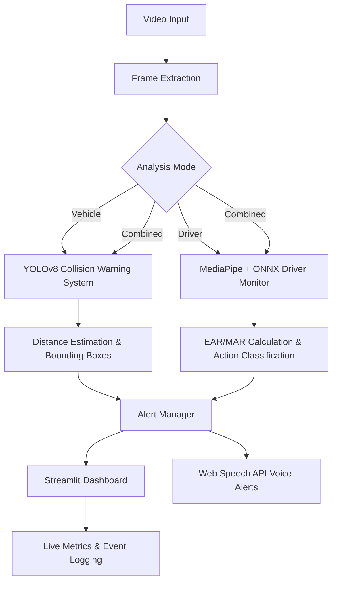
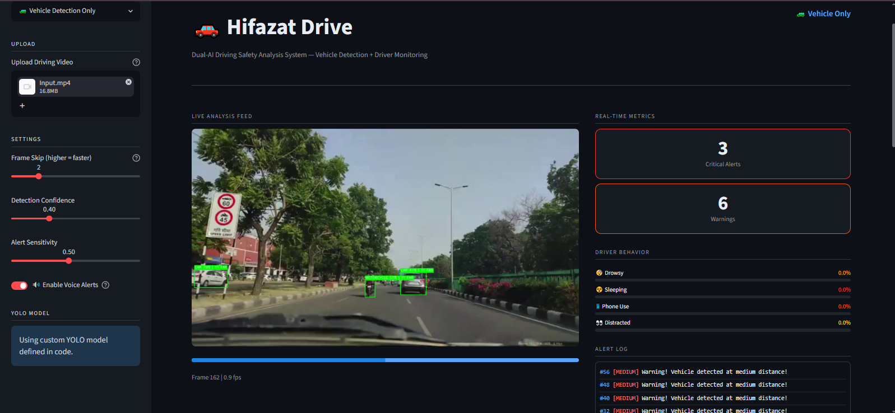

<div align="center">
  <h1>🚗 Hifazat Drive</h1>
  <h3>Dual-AI Driving Safety Analysis System</h3>
  <p><i>An advanced collision warning and driver monitoring dashboard built with Streamlit, YOLO, and MediaPipe.</i></p>

  
  
  
  
  
</div>

<hr>

## 📖 Table of Contents
* [Project Overview](#-project-overview)
* [System Architecture](#-system-architecture)
* [Core Features](#-core-features)
* [Interface & Demos](#-interface--demos)
* [Installation Guide](#-installation-guide)
* [Usage & Configuration](#-usage--configuration)
* [AI Models Deep-Dive](#-ai-models-deep-dive)
* [Project Structure](#-project-structure)

## 🎯 Project Overview
**Hifazat Drive** is a holistic vehicle safety application that processes dashcam or internal cabin footage to prevent accidents. By utilizing a dual-pipeline AI architecture, it simultaneously monitors the road ahead for imminent collisions and the driver's state for distraction, drowsiness, or phone usage.

The system features a rich, responsive **Streamlit Dashboard** that provides live metrics, a progressive alert system (including audible voice alerts), and exportable post-drive analytics.

## 🏗 System Architecture



## ✨ Core Features

### 1. Advanced Driver Monitoring System (DMS)
* **Fatigue Detection**: Uses MediaPipe Face Landmarker to compute Eye Aspect Ratio (EAR) and Mouth Aspect Ratio (MAR) to detect yawning and micro-sleeps.
* **Distraction & Phone Usage**: Uses a custom-trained ONNX model (`yolo_dms.onnx`) to identify dangerous driving behaviors like holding a phone or looking away from the road.
* **Temporal Smoothing**: Analyzes driver state over a rolling window to prevent false positive alerts from rapid, temporary head movements.

### 2. Collision Warning System (CWS)
* **Vehicle Tracking**: Identifies cars, rickshaws, and motorcycles in the forward driving path using a fine-tuned YOLO model (`CWS.pt`).
* **Proximity Alerts**: Estimates relative distance to the leading vehicle and generates color-coded warnings (Safe, Warning, Critical) based on bounding box scales.

### 3. Interactive Analytics Dashboard
* **Live Feed**: Real-time bounding boxes and state overlays with configurable frame-skipping for optimized performance on any hardware.
* **Dynamic Metrics**: Tracks percentages of driving time spent in specific states (Normal, Drowsy, Sleeping, Using Phone, Distracted).
* **Post-Drive Export**: Downloads the complete timeline of driving events and alerts as a CSV file.
* **Voice Agent**: Seamlessly reads critical alerts out loud in real-time using the browser's native Web Speech API.

---

## 📸 Interface & Demos

### 🖥️ User Interface Dashboard


### 🎬 Action Demos

**1. Driver Monitoring Alerts:**


https://github.com/user-attachments/assets/5ee64847-875b-41e2-87b8-6181b4dea2bb


**2. Collision Warning Detection Output:**


https://github.com/user-attachments/assets/afcc2211-4d3a-4070-b855-7f8f4d9aeb26


---

## ⚙️ Installation Guide

### Prerequisites
* Python 3.8 to 3.11
* A machine with a dedicated GPU is highly recommended for real-time processing, though CPU fallback is fully supported via ONNX.

### Step-by-Step Setup

1. **Clone the repository:**
   ```bash
   git clone https://github.com/Faran18/Hifazat-Drive.git
   cd Hifazat-Drive
   ```

2. **Set up a Virtual Environment:**
   ```bash
   # On Windows
   python -m venv .venv
   .venv\Scripts\activate

   # On macOS/Linux
   python3 -m venv .venv
   source .venv/bin/activate
   ```

3. **Install Python Dependencies:**
   ```bash
   pip install -r requirements.txt
   ```
   *Required packages include: `streamlit`, `opencv-python`, `numpy`, `pandas`, `mediapipe`, `ultralytics`, `onnxruntime`.*

4. **Prepare AI Models:**
   Ensure the following model files are placed in the root directory:
   - `CWS.pt` (Vehicle Detection Weights)
   - `yolo_dms.onnx` (Driver State Weights)
   - `yolo_classes.json` (Driver State Class Mapping)
   - `face_landmarker.task` (MediaPipe Face Mesh)

---

## 🚀 Usage & Configuration

To start the application, run the following command from the root folder:

```bash
streamlit run "User Interface/Main_App.py"
```

### Dashboard Settings
From the sidebar, you can configure the following parameters before starting the analysis:
* **Detection Mode**: Toggle between `Combined`, `Vehicle Only`, or `Driver Only` to save compute resources.
* **Frame Skip**: Increase this slider (e.g., to 2 or 3) to process every Nth frame. This significantly speeds up processing on lower-end hardware without losing much accuracy.
* **Confidence Threshold**: Determines the strictness of the YOLO object detection.
* **Alert Sensitivity**: Adjusts how quickly the system escalates from a "Warning" to a "Critical" alert.
* **Voice Alerts**: Toggle audible warnings on/off.

---

## 🧠 AI Models Deep-Dive

* **`CWS.pt`**: A custom-trained YOLO architecture optimized for detecting vehicles from a dashcam perspective. It categorizes proximity into safe/warning/critical zones.
* **`yolo_dms.onnx`**: Exported to ONNX for highly optimized CPU/GPU inference, this model classifies the driver's body language (e.g. using a phone). Mapped via `yolo_classes.json`.
* **MediaPipe Face Landmarker**: Processes 478 3D facial landmarks to calculate EAR (Eye Aspect Ratio) and MAR (Mouth Aspect Ratio) with sub-pixel accuracy to detect drowsiness and yawning.

---

## 📁 Project Structure

```text
Hifazat-Drive/
│
├── User Interface/
│   └── Main_App.py          # Streamlit frontend & main execution loop
│
├── Voice_Agent/
│   └── alert_manager.py     # Threshold logic & message generation
│
├── video_processor.py       # Orchestrator binding YOLO, MediaPipe, and Streamlit
├── yolo_detector.py         # Collision Warning System (CWS) logic
├── driver_monitor.py        # Driver Monitoring System (DMS) logic & EAR/MAR math
├── requirements.txt         # Project dependencies
│
├── CWS.pt                   # [Model] Vehicle Detection Weights
├── yolo_dms.onnx            # [Model] Driver Monitoring Weights
├── face_landmarker.task     # [Model] MediaPipe Face Mesh 
└── yolo_classes.json        # Class definitions for ONNX model
```


